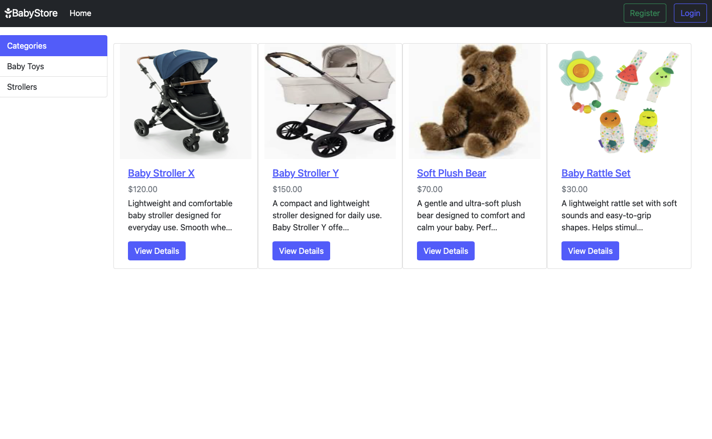

# Baby Tools Shop

A simple Django-based web application for browsing baby product categories and products.  
This project is part of the DevSecOps course and demonstrates how to run the application inside a Docker container and deploy it to a server.

## Table of Contents
- [Description](#description)
- [Tech Stack](#tech-stack)
- [Project Structure](#project-structure)
- [Quickstart](#quickstart)
  - [Prerequisites](#prerequisites)
  - [Run with Docker](#run-with-docker)
- [Usage](#usage)
  - [Admin panel](#admin-panel)
  - [Creating categories and products](#creating-categories-and-products)
  - [Static and media files](#static-and-media-files)
- [Configuration](#configuration)
  - [Environment variables](#environment-variables)
- [Deployment](#deployment)
- [Testing checklist](#testing-checklist)
- [Security notes](#security-notes)
- [Author](#author)

## Description
The **Baby Tools Shop** is a simple demo webshop built with Django.  
Users can browse categories and products, and administrators can manage shop content using the Django admin interface.

This project demonstrates:
- Django project structure
- Running Django inside a Docker container
- Deploying a containerized application to a remote server



## Tech Stack
- **Python:** 3.9  
- **Framework:** Django 4.0.2  
- **Database:** SQLite  
- **Containerization:** Docker  

## Project Structure
```
baby-tools-shop/
├─ babyshop_app/
│  ├─ babyshop/           
│  ├─ products/           
│  ├─ templates/
│  ├─ static/             
│  ├─ manage.py           
├─ .gitignore
├─ Checklist_Baby_Tools_Shop
├─ Dockerfile
├─ example.env
├─ requirements.txt
├─ README.md
```

## Quickstart

### Prerequisites
- Docker installed  
- Git installed  

### Run with Docker

1. **Clone the repository**
   ```bash
   git clone https://github.com/ognjenmanojlovic/baby-tools-shop.git
   ```

2. **Move into the project directory**
   ```bash
   cd baby-tools-shop
   ```

3. **Create your environment file**
   ```bash
   cp example.env .env
   ```
   *Open `.env` and adjust the values to your environment.*

4. **Build the Docker image**
   ```bash
   docker build -t baby-tools-shop .
   ```

5. **Run the container**
   ```bash
   docker run --rm --env-file .env -p 8025:8025 baby-tools-shop
   ```

6. **Open the application in your browser**
   ```
   http://127.0.0.1:8025
   ```

## Usage

### Admin panel

To access the Django admin interface:

```
http://127.0.0.1:8025/admin
```

Create an admin user:

```bash
docker exec -it $(docker ps -q --filter ancestor=baby-tools-shop) python babyshop_app/manage.py createsuperuser
```

### Creating categories and products
Inside the Django admin:
- Create Categories  
- Create Products (name, description, price, category, image)

### Static and media files
- Static files are served by Django  
- Uploaded product images go into `media/` (ignored by Git)

## Configuration

### Environment variables

Environment variables are used for sensitive and configurable settings:

```
DJANGO_SECRET_KEY
DJANGO_DEBUG
DJANGO_ALLOWED_HOSTS
```

Values must be stored in `.env`, not committed to Git.

## Deployment

### Deploying to a server

1. **Install Docker**
   ```bash
   sudo apt update
   sudo apt install -y docker.io
   ```

2. **Clone the repository**
   ```bash
   git clone https://github.com/ognjenmanojlovic/baby-tools-shop.git
   cd baby-tools-shop
   git checkout development
   ```

3. **Prepare your environment variables**
   ```bash
   cp example.env .env
   ```
   Edit `.env` and set:
   - `DJANGO_SECRET_KEY` to a secure value  
   - `DJANGO_ALLOWED_HOSTS=<your-server-ip>`  

4. **Build the Docker image**
   ```bash
   sudo docker build -t baby-tools-shop .
   ```

5. **Run the container**
   ```bash
   sudo docker run -d --restart unless-stopped --env-file .env -p 8025:8025 --name baby-tools-shop baby-tools-shop
   ```

6. **Open in browser**
   ```
   http://<your-server-ip>:8025
   ```

## Testing checklist
- [x] Application runs inside Docker  
- [x] Application deployed on server  
- [x] Public access works via `<your-server-ip>:8025`  

## Security notes
- No secrets or passwords are committed  
- `.env` is ignored by Git  
- Use secure values before running in production  

## Author
**Ognjen Manojlovic**

- [Instagram](https://instagram.com/0gisha)
- [LinkedIn](https://www.linkedin.com/in/ognjen-manojlovic-299a2b2a0)